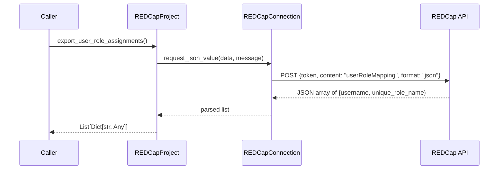

# Design Document: Export User-Role Assignments

## Overview

Add an `export_user_role_assignments()` method to the `REDCapProject` class that retrieves the current mapping of users to roles in a REDCap project. The method delegates to `REDCapConnection.request_json_value` with `content: "userRoleMapping"` and returns the parsed JSON list unchanged.

This is a thin wrapper following the same delegation pattern as `export_user_roles()`, `export_instruments()`, and other existing export methods. The method is the read counterpart to the existing `assign_user_role()` method.

## Architecture

The method fits into the existing two-layer architecture:



No new classes, modules, or architectural changes are needed. The method is added directly to `REDCapProject` in `redcap_project.py`.

**Design decision**: The method passes through the API response without transformation or validation. This is consistent with every other export method in the class (`export_user_roles`, `export_instruments`, `export_events`, etc.), which all return the raw parsed JSON from `request_json_value`. Keeping this pattern means the library stays a thin API wrapper rather than adding domain validation logic.

## Components and Interfaces

### Modified File: `common/src/python/redcap_api/redcap_project.py`

**New method on `REDCapProject`:**

```python
def export_user_role_assignments(self) -> List[Dict[str, Any]]:
    """Export user-role assignments for the project.

    Returns:
        List of dicts, each containing 'username' and 'unique_role_name'
        keys representing the mapping of users to roles.

    Raises:
        REDCapConnectionError if the response has an error.
    """
    message = "exporting user-role assignments"
    data = {"content": "userRoleMapping"}

    return self.__redcap_con.request_json_value(data=data, message=message)
```

**Placement**: After `export_user_roles()` and before `assign_user_role()`, grouping the role-related export methods together.

### New File: `common/src/python/redcap_api/test/python/test_redcap_project.py`

Unit and property tests for the new method. This will be the first test file for the core `redcap_api` package.

### New File: `common/src/python/redcap_api/test/python/BUILD`

Pants BUILD file for the test target.

## Data Models

No new data models are introduced. The method returns `List[Dict[str, Any]]`, where each dict has the structure:

```json
[
  {"username": "jsmith", "unique_role_name": "U-123ABC"},
  {"username": "jdoe", "unique_role_name": "U-456DEF"}
]
```

This matches the REDCap API response format for `content: "userRoleMapping"`. The `unique_role_name` may be an empty string if a user is not assigned to any role.

## Correctness Properties

*A property is a characteristic or behavior that should hold true across all valid executions of a system — essentially, a formal statement about what the system should do. Properties serve as the bridge between human-readable specifications and machine-verifiable correctness guarantees.*

### Property 1: Pass-through identity

*For any* list of dicts returned by `request_json_value`, `export_user_role_assignments` SHALL return that exact same list without modification.

**Validates: Requirements 1.3, 1.4**

This is the core correctness property. Since the method is a pass-through wrapper, the key invariant is that it never transforms, filters, or reorders the data. By generating random lists of user-role assignment dicts (varying in length, key values, and content) and mocking `request_json_value` to return them, we verify the method preserves the data identity across all inputs.

## Error Handling

Error handling is fully delegated to `REDCapConnection.request_json_value`, which:

1. **HTTP errors**: If the REDCap API returns a non-OK status, `request_json_value` raises `REDCapConnectionError` with the status code, reason, and response text.
2. **Connection failures**: If `requests.post` raises `SSLError` or `ConnectionError`, `post_request` wraps it in `REDCapConnectionError`.
3. **JSON decode errors**: If the response body is not valid JSON, `request_json_value` raises `REDCapConnectionError`.

The new method does not add any error handling of its own — it lets exceptions propagate naturally. This is consistent with `export_user_roles()`, `export_instruments()`, and `export_events()`.

## Testing Strategy

### Property-Based Tests (using Hypothesis)

Hypothesis is the standard PBT library for Python. It will be added as a test dependency.

- **Property 1 test**: Generate random lists of `{username, unique_role_name}` dicts using `@given` strategies. Mock `request_json_value` to return the generated list. Assert `export_user_role_assignments()` returns the identical object.
  - Minimum 100 iterations (Hypothesis default is higher).
  - Tag: `Feature: export-user-role-assignments, Property 1: Pass-through identity`

### Unit Tests (using pytest)

- **Correct payload**: Mock `REDCapConnection`, call `export_user_role_assignments()`, verify `request_json_value` was called with `data={"content": "userRoleMapping"}` and `message="exporting user-role assignments"`.
- **Error propagation (API error)**: Mock `request_json_value` to raise `REDCapConnectionError`, verify it propagates from `export_user_role_assignments()`.
- **Error propagation (connection failure)**: Same as above but with a connection-failure error message. Can be parameterized with the API error test.
- **Empty list**: Mock `request_json_value` to return `[]`, verify `export_user_role_assignments()` returns `[]`.

### Static Analysis

- **MyPy**: Validates the `List[Dict[str, Any]]` return type annotation.
- **Ruff**: Linting and formatting checks.
- **YAPF/docformatter**: Docstring formatting.

### Test Infrastructure

Since no tests exist yet for `redcap_api`, the following will be created:
- `common/src/python/redcap_api/test/python/BUILD` — Pants test target with dependencies on `redcap_api`, `pytest`, and `hypothesis`.
- `common/src/python/redcap_api/test/python/test_redcap_project.py` — Test file with both unit and property tests.
