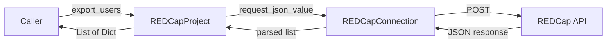

# Design Document

## Overview

Add an `export_users()` method to the `REDCapProject` class that retrieves the list of all users in a REDCap project along with their privileges. The method follows the established export pattern used by `export_instruments()`, `export_user_roles()`, and `export_user_role_assignments()`: it constructs a data payload, delegates to `REDCapConnection.request_json_value()`, and returns the parsed JSON response directly.

This is a thin pass-through method. The REDCap API handles authentication, authorization, and response formatting. The method's responsibility is limited to sending the correct payload (`{"content": "user"}`) and returning the result. Error handling is delegated entirely to `request_json_value()`, which raises `REDCapConnectionError` for HTTP errors, connection failures, and JSON parse errors.

## Architecture

The method fits into the existing layered architecture:



There are no new classes, modules, or dependencies. The method is added to the existing `REDCapProject` class in `common/src/python/redcap_api/redcap_project.py`.

### Design Decisions

1. **No parameters**: The REDCap Export Users API accepts optional `format` and `returnFormat` parameters, but the existing pattern always uses JSON format (set by `request_json_value`) and JSON error format (set by `post_request`). Adding optional parameters would break consistency with `export_instruments()` and `export_user_roles()`, which also take no parameters.

2. **Direct pass-through**: The method returns the raw parsed JSON without transforming, filtering, or validating the response. This matches the pattern of all other export methods and keeps the library as a thin API wrapper.

3. **No `action` key**: Unlike `export_user_role_assignments()` which historically used `{"content": "userRoleMapping", "action": "export"}`, the REDCap Export Users API does not require an `action` parameter. The data payload is simply `{"content": "user"}`.

## Components and Interfaces

### Modified Component: `REDCapProject`

**File**: `common/src/python/redcap_api/redcap_project.py`

New method added to the `REDCapProject` class:

```python
def export_users(self) -> List[Dict[str, Any]]:
    """Export the list of users for the project.

    Returns the list of users in the project with their privileges.
    Each entry contains at minimum ``username``, ``email``,
    ``firstname``, and ``lastname`` keys, along with privilege flags.

    Note: If a user has been assigned to a user role, the returned
    record reflects the role's defined privileges rather than
    individual settings.

    Returns:
        List of user dicts with privileges

    Raises:
        REDCapConnectionError if the response has an error
    """
    message = "exporting users"
    data = {"content": "user"}

    return self.__redcap_con.request_json_value(data=data, message=message)
```

### Existing Component: `REDCapConnection.request_json_value()`

No changes. This method already handles:
- Adding the API token and return format to the request
- Setting `format=json` on the POST request
- Raising `REDCapConnectionError` on non-OK HTTP responses
- Parsing the JSON response
- Raising `REDCapConnectionError` on `JSONDecodeError`

### New Test Class: `TestExportUsers`

**File**: `common/src/python/redcap_api/test/python/test_redcap_project.py`

A new test class following the exact pattern of `TestExportUserRoleAssignments`, using the existing `mock_connection` and `project` fixtures.

## Data Models

No new data models are introduced. The method returns `List[Dict[str, Any]]` — the same generic type used by all other export methods.

A typical user record returned by the REDCap API has this structure:

```python
{
    "username": "jsmith",
    "email": "jsmith@example.com",
    "firstname": "John",
    "lastname": "Smith",
    "expiration": "",
    "data_access_group": "",
    "design": 0,
    "alerts": 0,
    "user_rights": 0,
    "data_access_groups": 0,
    "data_export": 2,
    "reports": 1,
    "stats_and_charts": 1,
    "manage_survey_participants": 1,
    "calendar": 1,
    "data_import_tool": 0,
    "data_comparison_tool": 0,
    "logging": 0,
    "email_logging": 0,
    "file_repository": 1,
    "data_quality_create": 0,
    "data_quality_execute": 0,
    "api_export": 0,
    "api_import": 0,
    "api_modules": 0,
    "mobile_app": 0,
    "mobile_app_download_data": 0,
    "record_create": 1,
    "record_rename": 0,
    "record_delete": 0,
    "lock_records_customization": 0,
    "lock_records": 0,
    "lock_records_all_forms": 0,
    "forms": {"demographics": 1, "visit": 2},
    "forms_export": {"demographics": 0, "visit": 1}
}
```

## Correctness Properties

*A property is a characteristic or behavior that should hold true across all valid executions of a system — essentially, a formal statement about what the system should do. Properties serve as the bridge between human-readable specifications and machine-verifiable correctness guarantees.*

### Prework Summary

Most acceptance criteria for this feature are EXAMPLE or SMOKE tests because `export_users()` is a thin pass-through method with a fixed payload. The only universal property is the pass-through invariant: the method returns exactly what `request_json_value()` returns, without modification.

Criteria 1.3 (return parsed response) and 2.2 (preserve privilege flags) are logically the same property — if the entire response is passed through unchanged, all fields including privilege flags are necessarily preserved. These are consolidated into a single property.

Error propagation criteria (3.1, 3.2, 3.3) are all EXAMPLE tests — they verify that `REDCapConnectionError` raised by the mock propagates, which doesn't vary meaningfully with input.

Structural criteria (4.1–4.3) and test meta-requirements (5.1–5.5) are SMOKE checks verified by code review and type checking.

### Property 1: Pass-through invariant

*For any* list of user dictionaries returned by `request_json_value()`, `export_users()` SHALL return the exact same list without modification — no added, removed, or altered entries or fields.

**Validates: Requirements 1.3, 2.1, 2.2, 2.3**

## Error Handling

All error handling is delegated to `REDCapConnection.request_json_value()`. The `export_users()` method does not catch, wrap, or transform any exceptions. This matches the pattern of `export_instruments()`, `export_user_roles()`, and `export_user_role_assignments()`.

The following errors propagate as `REDCapConnectionError`:

| Error Condition | Source | Behavior |
|---|---|---|
| HTTP error (e.g., 403 Forbidden) | `request_json_value` checks `response.ok` | Raises `REDCapConnectionError` with HTTP status, reason, and response text |
| Network/SSL failure | `post_request` catches `SSLError` and `ConnectionError` | Raises `REDCapConnectionError` with connection error details |
| Invalid JSON response | `request_json_value` catches `JSONDecodeError` | Raises `REDCapConnectionError` with the message string |

No new error handling code is needed.

## Testing Strategy

### Property-Based Testing Applicability

PBT is applicable to this feature in a limited way. The single property (pass-through invariant) can be tested by generating random lists of user dictionaries and verifying the method returns them unchanged. However, given that the method is a one-line delegation, the value of running 100+ iterations is modest. The property test is still worth writing because it formally verifies the pass-through contract and catches any accidental transformation that might be introduced during future refactoring.

**PBT Library**: [Hypothesis](https://hypothesis.readthedocs.io/) — the standard property-based testing library for Python, already compatible with pytest.

### Property Test

- **Property 1: Pass-through invariant** — Generate random lists of dictionaries (with string keys and mixed-type values), mock `request_json_value` to return them, call `export_users()`, and assert the result is identical. Minimum 100 iterations.
- Tag: `Feature: export-users, Property 1: For any list of user dictionaries returned by request_json_value, export_users SHALL return the exact same list without modification`

### Unit Tests (Example-Based)

Following the `TestExportUserRoleAssignments` pattern:

| Test | What it verifies | Validates |
|---|---|---|
| `test_sends_correct_payload` | `request_json_value` called with `data={"content": "user"}, message="exporting users"` | Req 1.1, 1.2, 4.1 |
| `test_returns_parsed_response` | Returns the list of user dicts from the mock | Req 1.3, 2.1, 2.2 |
| `test_returns_empty_list` | Returns `[]` when mock returns `[]` | Req 2.3 |
| `test_propagates_api_error` | `REDCapConnectionError` from mock propagates (HTTP error) | Req 3.1 |
| `test_propagates_connection_error` | `REDCapConnectionError` from mock propagates (connection failure) | Req 3.2, 3.3 |

### Test Infrastructure

- **Mocking**: `unittest.mock.create_autospec(REDCapConnection, instance=True)` — same as existing tests (Req 5.5)
- **Fixtures**: Reuse existing `mock_connection` and `project` pytest fixtures
- **Test class**: `TestExportUsers` in `test_redcap_project.py`
- **Build target**: Existing `python_tests` target in `common/src/python/redcap_api/test/python/BUILD`
