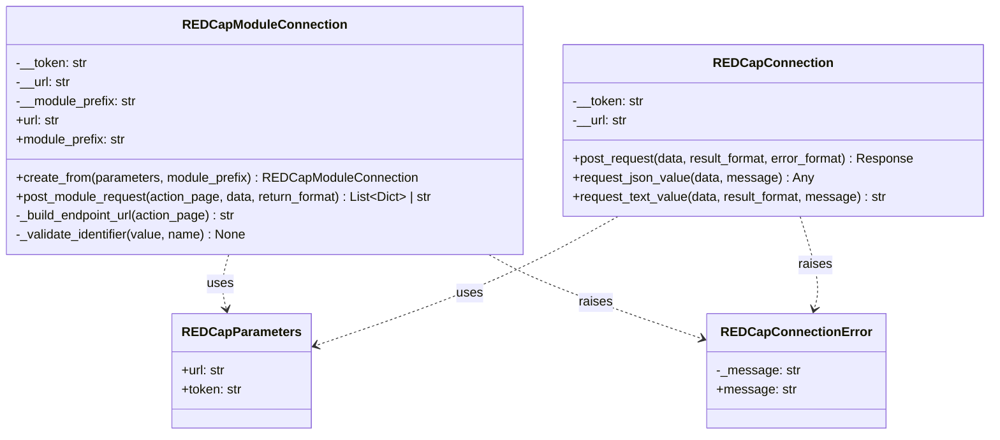
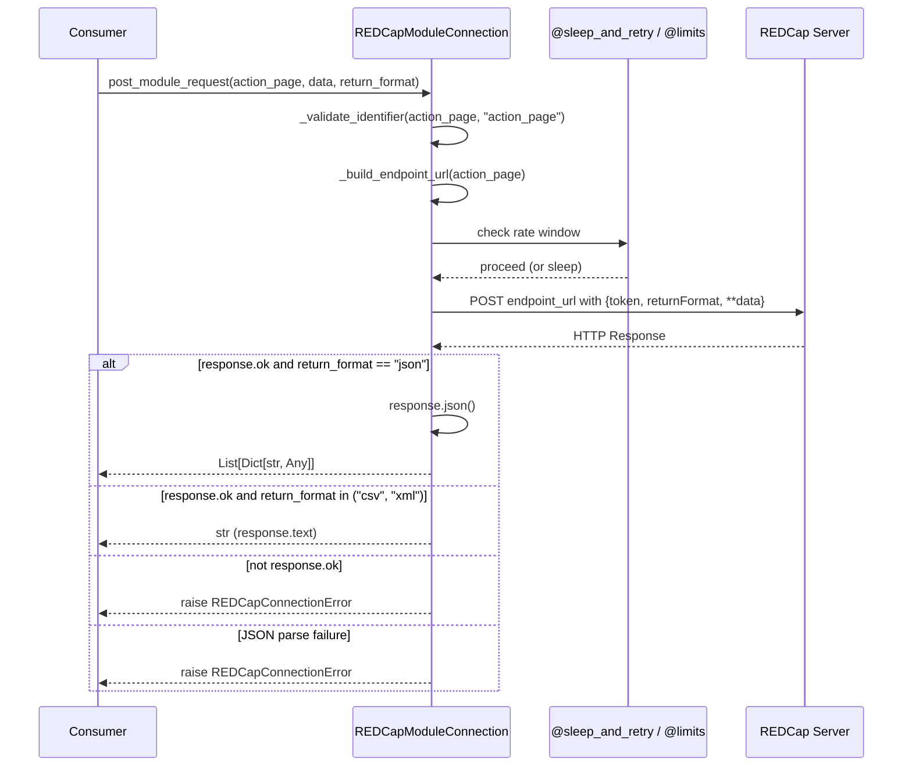

# Design Document: REDCap Module Connection

## Overview

This design introduces `REDCapModuleConnection`, a new connection class in the `redcap_api` package that enables communication with REDCap External Module endpoints. While the existing `REDCapConnection` posts to the standard REDCap API using content-based routing on a fixed URL, External Modules expose their own endpoints using a query-string URL pattern:

```
POST <base_url>/api/?NOAUTH&type=module&prefix=<module_prefix>&page=<action_page>
```

`REDCapModuleConnection` reuses the same authentication pattern (API token in POST data) and rate-limiting behavior (20 calls per 1-second window with sleep-and-retry) as `REDCapConnection`. It is designed as a general-purpose building block. The package will not contain module-specific wrappers; consumers of the library build those on top.

### Key Design Decisions

1. **Composition over inheritance**: `REDCapModuleConnection` does not inherit from `REDCapConnection` because the URL construction pattern is fundamentally different (query-string routing vs. fixed endpoint with content-based routing). Sharing a base class would couple the two strategies unnecessarily.

2. **Consistent factory pattern**: Uses `@classmethod create_from` accepting `REDCapParameters` and a module prefix as keyword-only arguments, matching the existing convention.

3. **Action page as method parameter**: The module prefix is fixed at construction time (a connection targets one module), while the action page is passed per-request. This mirrors how modules typically expose multiple pages (e.g., `status`, `lock`, `unlock`) under a single prefix.

4. **Input validation at boundaries**: Module prefix and action page are validated against a strict character set (lowercase alphanumeric + underscores, max 64 chars) at construction and at request time respectively. Invalid values raise `REDCapConnectionError`.

## Architecture



### Request Flow



## Components and Interfaces

### REDCapModuleConnection

**Module**: `redcap_api.redcap_module_connection`

```python
class REDCapModuleConnection:
    """Connection class for posting requests to REDCap External Module endpoints."""

    def __init__(self, *, token: str, url: str, module_prefix: str) -> None:
        """Initialize a module connection.

        Args:
            token: API token for the REDCap project.
            url: Base URL of the REDCap instance (e.g., "https://redcap.example.com").
            module_prefix: The module prefix identifier (e.g., "locking_api").

        Raises:
            REDCapConnectionError: If module_prefix is invalid.
        """

    @property
    def url(self) -> str:
        """The base REDCap URL."""

    @property
    def module_prefix(self) -> str:
        """The module prefix for this connection."""

    @classmethod
    def create_from(
        cls, *, parameters: REDCapParameters, module_prefix: str
    ) -> "REDCapModuleConnection":
        """Create a module connection from REDCap parameters.

        Args:
            parameters: REDCapParameters with url and token.
            module_prefix: Non-empty module prefix string.

        Returns:
            Configured REDCapModuleConnection instance.

        Raises:
            ValueError: If module_prefix is empty or not a string.
        """

    @sleep_and_retry
    @limits(calls=20, period=1)
    def post_module_request(
        self,
        *,
        action_page: str,
        data: Dict[str, str],
        return_format: str = "json",
    ) -> List[Dict[str, Any]] | str:
        """Post a request to a module endpoint.

        Args:
            action_page: The action page for the module endpoint.
            data: Dictionary of POST parameters to send.
            return_format: One of "json", "csv", or "xml".

        Returns:
            Parsed JSON as List[Dict[str, Any]] if return_format is "json",
            otherwise the response text as str.

        Raises:
            REDCapConnectionError: On invalid action_page, HTTP errors,
                network errors, or JSON parse failures.
        """

    def _build_endpoint_url(self, action_page: str) -> str:
        """Construct the full module endpoint URL.

        Combines base URL, module prefix, and action page into the standard
        External Module URL pattern.
        """

    @staticmethod
    def _validate_identifier(value: str, name: str) -> None:
        """Validate that a string is a valid module identifier.

        Valid identifiers contain only lowercase alphanumeric characters and
        underscores, are non-empty, and are at most 64 characters long.

        Raises:
            REDCapConnectionError: If validation fails.
        """
```

### Validation Rules

| Parameter | Allowed Characters | Min Length | Max Length | Error Type |
|-----------|-------------------|-----------|-----------|-----------|
| `module_prefix` | `[a-z0-9_]` | 1 | 64 | `REDCapConnectionError` (constructor), `ValueError` (factory) |
| `action_page` | `[a-z0-9_]` | 1 | 64 | `REDCapConnectionError` |

The factory method (`create_from`) raises `ValueError` for an empty/non-string module prefix (per Requirement 4.3), while the constructor raises `REDCapConnectionError` for prefix/page values failing the character-set validation (per Requirement 1.4). This distinction allows the factory to fail fast with a standard Python error for obviously wrong types, while runtime validation of string content uses the domain-specific error.

### URL Construction Logic

```python
def _build_endpoint_url(self, action_page: str) -> str:
    base = self.__url.rstrip("/")
    return f"{base}/api/?NOAUTH&type=module&prefix={self.__module_prefix}&page={action_page}"
```

The trailing-slash normalization ensures that `https://redcap.example.com` and `https://redcap.example.com/` produce the same endpoint URL (Requirement 1.2).

## Data Models

### Input Types

The class consumes the existing `REDCapParameters` TypedDict:

```python
class REDCapParameters(TypedDict):
    url: str
    token: str
```

### POST Payload Assembly

For each request, the payload is assembled as:

```python
payload = {
    "token": self.__token,
    "returnFormat": return_format,
    **data,  # caller-provided parameters
}
```

The token is never exposed in error messages. If the server returns an error, the exception includes the HTTP status code, reason, and response text but omits the token value.

### Return Types

| `return_format` | Return Type | Processing |
|----------------|-------------|-----------|
| `"json"` | `List[Dict[str, Any]]` | `response.json()` parsed |
| `"csv"` | `str` | `response.text` |
| `"xml"` | `str` | `response.text` |

### Error Conditions

| Condition | Exception | Message Content |
|-----------|-----------|----------------|
| Invalid module_prefix/action_page | `REDCapConnectionError` | Which parameter is invalid and why |
| HTTP error response | `REDCapConnectionError` | Status code, reason, response text |
| Network/SSL error | `REDCapConnectionError` | Underlying exception message |
| JSON parse failure | `REDCapConnectionError` | Indication that JSON parsing failed |
| Empty/non-string prefix in factory | `ValueError` | "A non-empty module prefix is required" |

## Correctness Properties

*A property is a characteristic or behavior that should hold true across all valid executions of a system — essentially, a formal statement about what the system should do. Properties serve as the bridge between human-readable specifications and machine-verifiable correctness guarantees.*

### Property 1: URL Round-Trip Construction

*For any* valid base URL (starting with `http://` or `https://` and containing a hostname), any valid module prefix (a non-empty string of `[a-z0-9_]` with max 64 characters), and any valid action page (same constraints), the constructed endpoint URL, when parsed, SHALL have a path ending in `/api/` and query parameters containing `NOAUTH` (empty value), `type=module`, `prefix=<module_prefix>`, and `page=<action_page>`. Furthermore, a base URL with a trailing slash SHALL produce the same endpoint as one without.

**Validates: Requirements 1.1, 1.2, 6.1**

### Property 2: Identifier Validation Boundary

*For any* string matching the pattern `^[a-z0-9_]{1,64}$`, the identifier validation SHALL accept it without error. *For any* string that is empty, contains only whitespace, contains characters outside `[a-z0-9_]`, or exceeds 64 characters, the identifier validation SHALL raise a `REDCapConnectionError` indicating which parameter is invalid.

**Validates: Requirements 1.4, 1.5, 6.2**

### Property 3: Token Inclusion Invariant

*For any* valid action page and any dictionary of POST parameters, when `post_module_request` is called, the data sent to the server SHALL always contain the `"token"` field set to the connection's configured API token and the `"returnFormat"` field set to the requested format.

**Validates: Requirements 2.1, 3.1, 3.2**

### Property 4: Error Message Security

*For any* HTTP error response (status code, reason, response text) and any API token value, the raised `REDCapConnectionError` message SHALL contain the HTTP status code and reason but SHALL NOT contain the API token string.

**Validates: Requirements 2.4, 3.3**

### Property 5: JSON Response Pass-Through

*For any* list of dictionaries returned as a valid JSON HTTP response body, when `post_module_request` is called with `return_format="json"`, the method SHALL return the exact same list without modification.

**Validates: Requirements 3.1**

### Property 6: Text Response Pass-Through

*For any* text string returned as an HTTP response body, when `post_module_request` is called with `return_format` of `"csv"` or `"xml"`, the method SHALL return the exact response text without modification.

**Validates: Requirements 3.2**

### Property 7: Invalid JSON Detection

*For any* response body that is not valid JSON (given a successful HTTP status), when `post_module_request` is called with `return_format="json"`, the method SHALL raise a `REDCapConnectionError` indicating that JSON parsing failed.

**Validates: Requirements 3.5**

### Property 8: Factory Construction Round-Trip

*For any* valid `REDCapParameters` (containing a URL string and a token string) and any valid module prefix string, calling `create_from` SHALL produce an instance whose `url` property equals the parameters' URL and whose `module_prefix` property equals the provided module prefix.

**Validates: Requirements 4.1, 4.4**

## Error Handling

### Error Hierarchy

`REDCapModuleConnection` uses the existing `REDCapConnectionError` exception class for all domain errors, maintaining consistency with `REDCapConnection`. The only exception is the factory method `create_from`, which raises `ValueError` for type/emptiness checks on the module prefix argument (following Python conventions for obviously wrong argument types).

### Error Handling Strategy

| Layer | Error Source | Handling |
|-------|-------------|----------|
| Input validation | Invalid identifier chars/length | Raise `REDCapConnectionError` with parameter name and constraint description |
| Factory validation | Empty or non-string prefix | Raise `ValueError` with descriptive message |
| Network | `requests.exceptions.ConnectionError`, `SSLError` | Catch and wrap in `REDCapConnectionError` with original message |
| HTTP | Non-2xx status code | Raise `REDCapConnectionError` with status, reason, and response text |
| Parsing | `JSONDecodeError` | Catch and wrap in `REDCapConnectionError` indicating parse failure |

### Security Considerations

- The API token is stored in a private attribute (`self.__token`) and never exposed through properties.
- Error messages from HTTP failures include the status code, reason, and response text but explicitly exclude the token value from the constructed error message.
- The `error_message` helper function from `redcap_connection.py` is reused for consistent error formatting.

### Error Message Format

Error messages follow the existing pattern from `REDCapConnection`:

```
Error: {message}\nHTTP Error:{status_code} {reason}: {response_text}
```

For validation errors:
```
Invalid {parameter_name}: must contain only lowercase alphanumeric characters and underscores, 1-64 characters long
```

## Testing Strategy

### Dual Testing Approach

The testing strategy uses both example-based unit tests and property-based tests:

- **Property-based tests** (using Hypothesis): Verify universal correctness properties across randomly generated inputs. Each property test runs a minimum of 100 iterations.
- **Unit tests** (using pytest): Verify specific scenarios, integration points, error conditions, and structural requirements.

### Property-Based Testing

**Library**: [Hypothesis](https://hypothesis.readthedocs.io/) (already used in the project for `test_redcap_project.py`)

**Configuration**: Each property test runs with `max_examples=100` and uses `@settings(suppress_health_check=[HealthCheck.function_scoped_fixture])` when fixtures are needed.

**Tag Format**: Each property test docstring references the design property:
```
Feature: redcap-module-connection, Property {number}: {property_text}
```

**Property Test Plan**:

| Property | Strategy | Generator |
|----------|----------|-----------|
| 1: URL Round-Trip | Generate valid (base_url, prefix, action_page), build URL, parse with `urllib.parse`, assert components | `st.from_regex(r'https?://[a-z]+\.[a-z]+', fullmatch=True)` for URLs; `st.from_regex(r'[a-z0-9_]{1,64}', fullmatch=True)` for identifiers |
| 2: Identifier Validation | Generate valid and invalid strings, verify acceptance/rejection | Valid: `st.from_regex(r'[a-z0-9_]{1,64}')`, Invalid: `st.text()` filtered |
| 3: Token Inclusion | Generate random data dicts and action pages, mock POST, verify payload | `st.dictionaries(st.text(min_size=1), st.text())` |
| 4: Error Message Security | Generate random tokens and error responses, verify token absent from message | `st.text(min_size=8)` for tokens |
| 5: JSON Pass-Through | Generate random list-of-dicts, mock response, verify identity | `st.lists(st.dictionaries(...))` |
| 6: Text Pass-Through | Generate random text, mock response, verify identity | `st.text()` |
| 7: Invalid JSON Detection | Generate non-JSON strings, mock response, verify error | `st.text().filter(lambda s: not is_valid_json(s))` |
| 8: Factory Round-Trip | Generate valid params and prefix, call factory, check properties | Combined strategies |

### Unit Test Plan

| Test Area | Cases |
|-----------|-------|
| Constructor | Valid construction, invalid prefix raises error |
| Factory `create_from` | Valid params, empty prefix raises ValueError, non-string prefix raises ValueError |
| `post_module_request` | Successful JSON response, successful CSV response, HTTP error raises, network error raises, SSL error raises |
| Rate limiting | Decorator presence verification |
| Keyword-only args | Positional arg raises TypeError |
| URL construction | Trailing slash normalization, different action pages |

### Test File Structure

```
common/src/python/redcap_api/test/python/
├── test_redcap_module_connection.py    # Unit tests + property tests
└── ...
```

### Build System Integration

The existing `python_tests(name="tests")` target in the test BUILD file will automatically discover the new test file following the `test_*.py` naming convention. No BUILD file changes are required for test discovery.

The source file `redcap_module_connection.py` will be automatically included by the existing `python_sources(name="redcap_api")` target since it follows the standard Python source naming convention in the package directory.

